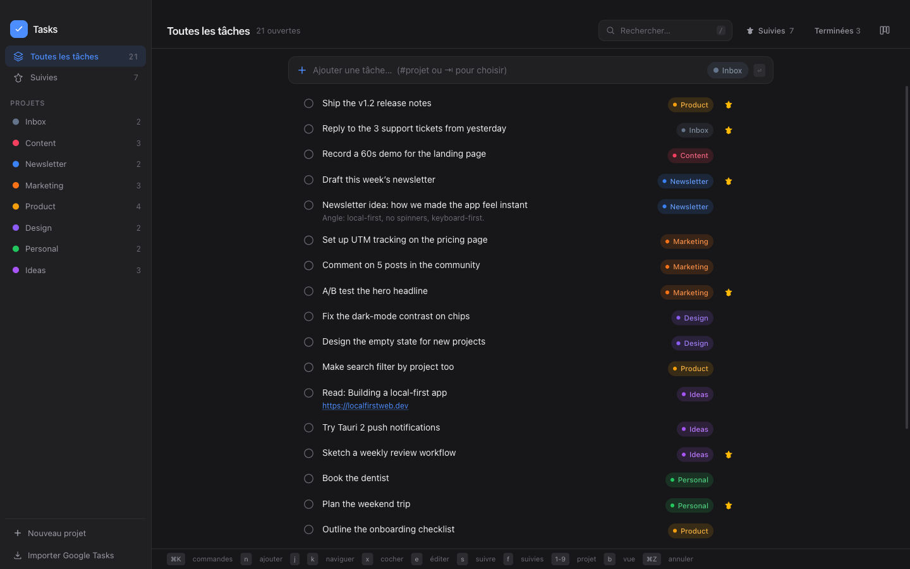
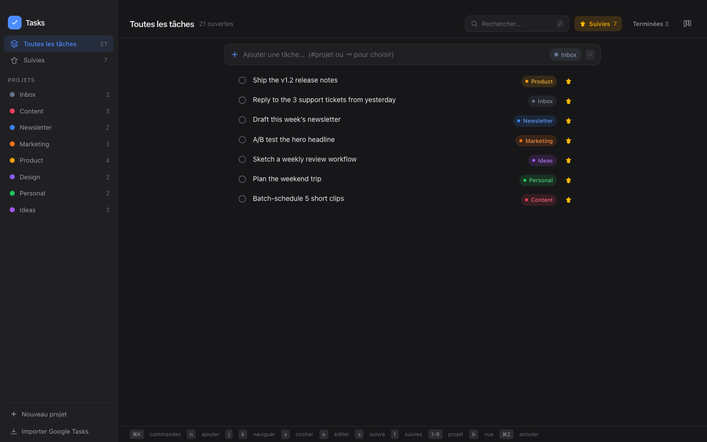
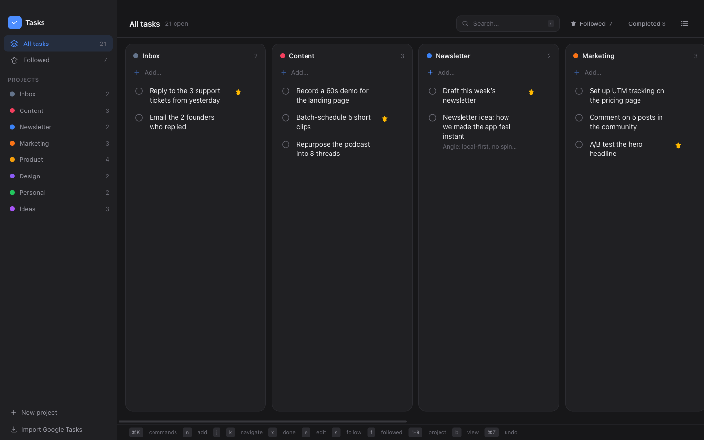

# Open Tasks

A fast, keyboard-first todo app. Think Google Tasks, but with a single global view of everything, colored project tags, and almost no clicking. One codebase runs on the web, on macOS (a real app in your Dock), and on iOS.



## Why it exists

Google Tasks is clean but siloed: your tasks live inside separate lists and you can never see everything at once. Notion is powerful but heavy: every action is a click, pages take a moment to load, and it is overkill for a plain todo list.

Open Tasks keeps the calm look of Google Tasks and adds the one thing it is missing: a single global view where every task carries a colored tag for its project. You add, tag, star, reorder, and complete tasks almost entirely from the keyboard.

## Feels instant, and here is why

The speed does not come from Rust. It comes from being **local-first**.

- All your data lives in the browser (localStorage). Reads never touch the network, so there are no spinners and no loading states. Every keystroke, toggle, and reorder is applied to local state and painted on the next frame.
- The UI is a lightweight React + TypeScript app built with Vite and styled with Tailwind CSS v4. No heavy component framework, no data-fetching layer on the hot path.
- Cloud sync (optional, see below) runs in the background. A reorder writes a single row thanks to fractional ordering, so syncing never blocks the interface.
- The desktop and mobile apps are wrapped with [Tauri 2](https://tauri.app). Tauri gives a tiny native shell (the Rust part is about fifteen lines) around the exact same web frontend, so the app starts fast and stays small. Rust ships the app; it is not what makes typing feel instant.

So: local-first state for instant feel, React + Vite + Tailwind for a light UI, Tauri to package it everywhere.

## How it compares

| | Google Tasks | Notion | Open Tasks |
| --- | --- | --- | --- |
| One global view of all tasks | No | Yes, with setup | Yes, out of the box |
| Colored project tags | No | Manual | Yes, automatic |
| Keyboard-first | Limited | Limited | Yes |
| Feels instant | Yes | No | Yes |
| Works offline / local-first | Partly | No | Yes, fully |
| Native Mac + iOS app | Web only | Heavy app | Yes, one codebase |
| Self-hostable / open source | No | No | Yes (MIT) |

---

# Tutorial: everything you can do

Everything below works from the keyboard. The mouse is always optional.

## 1. Add a task, and file it in one keystroke

Press `n` (or `a`) to jump into the quick-add field, type the task, press `Enter`. Done.

The fastest way to file a task in the right project is the **`#project` syntax**. Type a `#` followed by a project name anywhere in the task and it lands there automatically:

```
Draft the launch email #Marketing
Fix the dark-mode contrast #Design
Call the plumber #Personal
```

- The `#tag` is stripped from the title, so the saved task reads "Draft the launch email" and gets the Marketing tag.
- If the project does not exist yet, it is created on the fly with a fresh color.
- Prefer to pick from a list? Press `Tab` inside the quick-add field to open the project picker instead of typing the name.

You never have to open a project first and then add a task inside it. You just type.

## 2. Edit a task

Click a task title to edit it in place, or select it and press `e` (or `Enter`). No double-click, no modal. Press `Enter` to save, `Escape` to cancel.

## 3. Complete a task

Select a task and press `x` (or `Space`), or click its circle. Completed tasks move out of the way. Toggle "Terminées" in the top bar to see and reopen them.

## 4. Star it to follow it



Press `s` on a task (or click its star) to follow it. Then press `f`, or click **Suivies** in the top bar, to filter down to just your followed tasks across every project. The left sidebar is your vertical navigation: "Toutes les tâches" for the global view, "Suivies" for followed only, and one entry per project below.

## 5. Organize with projects

- **Create a project** from the sidebar ("Nouveau projet"), or just by tagging a task with a `#name` that does not exist yet.
- **Jump to a project** by pressing its number: `1` through `9` map to your projects in order. Press `0` to return to the global "Toutes les tâches" view.
- Each project gets a distinct color, applied automatically to its tag everywhere.

## 6. Move a task to another project

Click a task's colored project tag. A picker pops up; choose another project and the task moves. This is the quickest way to reclassify something without editing it.

## 7. Reorder tasks

Drag and drop any task to reorder it, in both the list and the board. The task you just moved keeps focus so you do not lose your place. From the keyboard, select a task and press `Cmd/Ctrl + Up` or `Cmd/Ctrl + Down` to nudge it up or down.

## 8. Switch between list and board



Press `b` to toggle between the global list and the board (one column per project, Kanban style). The board respects your active filters, including the "Suivies" followed filter, so `f` then `b` gives you a board of only your starred work.

## 9. Search

Press `/` to focus search and filter tasks by text instantly. It matches titles and notes, and works together with the current view.

## 10. Command palette

Press `Cmd/Ctrl + K` to open the command palette from anywhere and run actions without hunting for buttons.

## 11. Undo and redo

Press `Cmd/Ctrl + Z` to undo your last action: uncheck what you just checked, restore what you just deleted, and so on. `Cmd/Ctrl + Shift + Z` redoes it.

## 12. Clickable links

URLs in a task title or note are detected automatically and open in your browser with a click.

## 13. Import from Google Tasks

Use "Importer Google Tasks" in the sidebar to bring your existing lists and tasks in from a Google Tasks export, so you can switch over without retyping anything.

---

## Keyboard shortcuts (full list)

| Key | Action |
| --- | --- |
| `n` or `a` | New task (focus quick-add) |
| `#name` (in quick-add) | File the task straight into that project |
| `Tab` (in quick-add) | Open the project picker |
| `Enter` | Save the task |
| `j` / `ArrowDown` | Move selection down |
| `k` / `ArrowUp` | Move selection up |
| `e` / `Enter` | Edit the selected task |
| `x` / `Space` | Toggle done |
| `s` | Star / follow |
| `f` | Toggle the followed ("Suivies") filter |
| `Backspace` / `Delete` | Delete the selected task |
| `b` | Toggle list / board view |
| `1`..`9` | Jump to project N |
| `0` | Back to the global view |
| `/` | Focus search |
| `Cmd/Ctrl + K` | Command palette |
| `Cmd/Ctrl + Up` / `Down` | Reorder the selected task |
| `Cmd/Ctrl + Z` | Undo |
| `Cmd/Ctrl + Shift + Z` | Redo |
| `Escape` | Deselect |

Note: many row actions (`x`, `s`, `e`, delete) apply to the task under your mouse if you are hovering one, otherwise to the keyboard-selected task.

---

## Run it locally (no account, no server)

Out of the box the app runs 100% locally: your tasks are stored in the browser, there is no login, and nothing leaves your machine.

```bash
npm install
npm run dev
```

Then open http://localhost:5173. A curated demo dataset is seeded on first run so the app looks alive; your first real action replaces it.

## Build the apps

One codebase, three targets.

- **Web:** `npm run build` produces a static bundle in `dist/` that you can host anywhere.
- **macOS app:** `npm run build:mac` builds a real `.app` you can drop in your Applications folder and Dock (Tauri).
- **iOS app:** `npm run tauri ios init` then `npm run tauri ios build`. You need Xcode and an Apple Developer account to sign and ship to TestFlight.

The mobile UI is included and open source too: on a small screen it switches to a Google-Tasks-style pager where you swipe horizontally between lists.

## Optional: cloud sync across devices

Sync is off by default. If you want your tasks to follow you across web, Mac, and iOS, point the app at a [Supabase](https://supabase.com) project. Sync turns on automatically when both environment variables are present, and stays off otherwise (the app keeps running fully locally).

Create a `.env` file at the project root:

```
VITE_SUPABASE_URL=your-project-url
VITE_SUPABASE_ANON_KEY=your-anon-public-key
```

Notes:

- Only the **anon / publishable** key belongs in the frontend. Never put a `service_role` key in the app or in the repo.
- Row Level Security is enabled so each user only ever sees their own rows. The SQL lives in `supabase/migrations/`.
- Auth supports email magic link, password, and a 6-digit code (handy inside the mobile webview).
- `.env` is gitignored. Keep it that way.

## Tech stack

- React 19 + TypeScript
- Vite (build + dev server)
- Tailwind CSS v4
- Zustand (+ persist to localStorage) for state
- Tauri 2 for the macOS and iOS shells
- Supabase (Postgres + Auth + Realtime) for optional sync

## License

[MIT](LICENSE). Do what you like with it.
